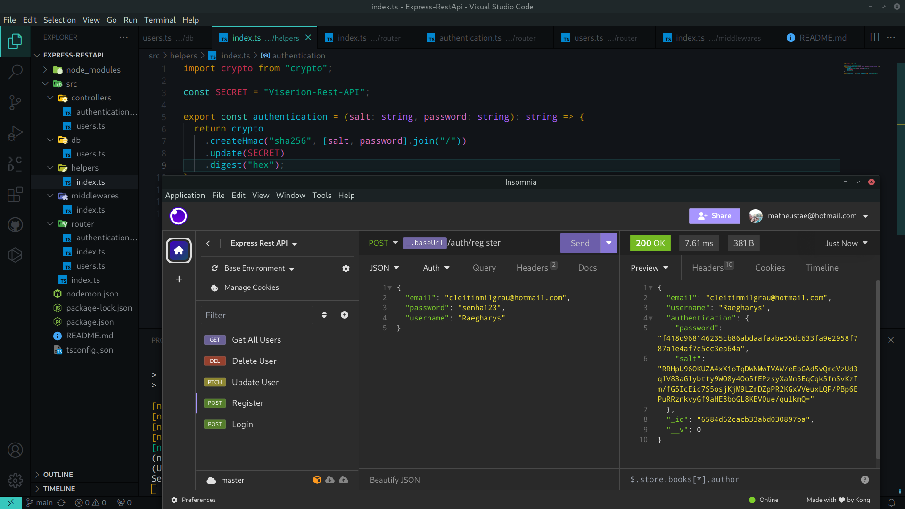

# REST API with Node.js, Express, and TypeScript

Este projeto é uma API REST com autenticação utilizando Node.js, Express e TypeScript, com o MongoDB como banco de dados.




## Pré-requisitos

Antes de começar, certifique-se de ter o [Node.js](https://nodejs.org/) instalado em sua máquina.


## Configuração do Ambiente

1. **Clone o Repositório:**
   ```bash
   git clone https://github.com/matheusz-nied/api-rest-express
   cd seu-projeto
   ```

2. **Instale as Dependências:**
   ```bash
   npm install
   ```

3. **Configuração do Banco de Dados:**
   - Configure a conexão com o MongoDB no arquivo `.env`.
   - Certifique-se de ter um banco de dados MongoDB em execução.

4. **Execute a Aplicação:**
   ```bash
   npm start
   ```

